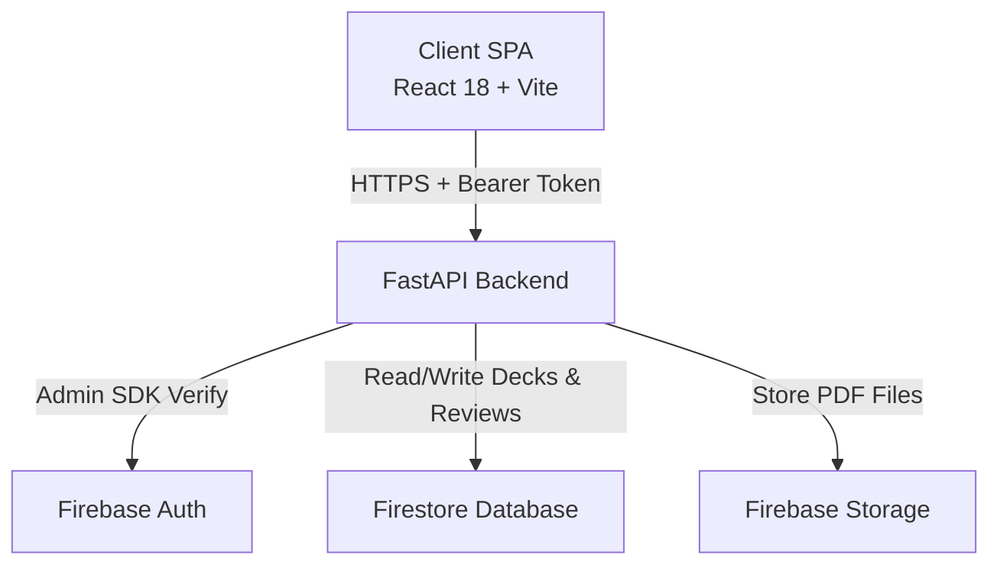

# LexiCore: AI-Supported English Vocabulary Learning Platform

> An adaptive flashcard application that automates term extraction from academic documents and schedules reviews using spaced-repetition.

## Overview

LexiCore is a full-stack flashcard application built to solve the problem of manual study preparation. We designed LexiCore specifically for students and professionals who need to process domain-dense academic content quickly. Users upload a PDF document, and the backend automatically surfaces the highest-signal academic terms. The system then schedules personalized review sessions to optimize long-term memory retention.

---

## Features

- **Automated Term Extraction:** The system extracts key vocabulary from uploaded PDF documents using a heuristic pipeline.
- **Adaptive Spaced-Repetition:** The application calculates optimal review intervals using a custom SM-2 algorithm.
- **Seamless Deck Management:** You can create custom decks, add manual cards, and organize your lessons.
- **Study Analytics:** The dashboard tracks your progress and visualizes your 7-day review history.

---

## Getting Started

This section guides newcomers through the setup process. We assume you have no prior knowledge of the project structure.

### Prerequisites

Before you begin, install the following required software:
- **Python 3.11** or newer
- **Node.js 18** or newer
- A **Google Firebase** account

### Installation Guide

#### 1. Clone the Repository

Clone the project to your local machine:
```bash
git clone https://github.com/your-username/LexiCore.git
cd LexiCore
```

#### 2. Configure Firebase

LexiCore requires Firebase for database and authentication services.
1. Open the [Firebase Console](https://console.firebase.google.com/) and create a new project.
2. Enable **Authentication** (Select Email/Password).
3. Enable **Firestore Database** (Start in production mode).
4. Enable **Firebase Storage**.
5. Navigate to Project Settings -> Service Accounts -> Generate a new private key.
6. Save the downloaded JSON file as `backend/service-account.json`.

#### 3. Set Up the Backend

We use Python and FastAPI to run the backend server. Run these commands to start it:

```bash
cd backend

# Create and activate a virtual environment
python -m venv .venv
.venv\Scripts\activate  # On macOS/Linux use: source .venv/bin/activate

# Install required dependencies
pip install -r requirements.txt

# Create the environment configuration file
cp .env.example .env
```
*Note: Open `backend/.env` and update the values with your Firebase project details.*

Start the backend API server:
```bash
uvicorn app.main:app --reload --port 8000
```
*The API runs at `http://localhost:8000`. You can view the interactive documentation at `http://localhost:8000/docs`.*

#### 4. Set Up the Frontend

We use React and Vite to run the client interface. Open a new terminal window and run these commands:

```bash
cd frontend

# Install JavaScript dependencies
npm install

# Create the environment configuration file
cp .env.example .env
```
*Note: Open `frontend/.env` and add your Firebase Web Client credentials.*

Start the frontend development server:
```bash
npm run dev
```
*The web application runs at `http://localhost:5173`.*

---

## Usage Instructions

Follow these steps to study with LexiCore:
1. **Register an Account:** Open `http://localhost:5173` and create a new user account.
2. **Upload a Document:** Navigate to the "Lessons" page and upload an academic PDF.
3. **Generate Flashcards:** Review the terms our system extracts from your file, and click "Generate" to build your deck.
4. **Study:** Start a study session. Rate your recall for each card (Easy, Medium, Hard, Unknown). LexiCore schedules the next review automatically.

---

## Developer Guide & Architecture

This section provides maintainers with technical context, architectural diagrams, and API references.

### System Architecture

We separate the application into a React Single-Page Application (SPA) and a FastAPI backend service.



### Core Mechanisms

- **Stateless API:** The backend requires a Firebase ID Token for every request. It authenticates users without storing session state.
- **Transactional Writes:** The system executes spaced-repetition updates (card state mutations) inside a single Firestore transaction to prevent data corruption.
- **Extraction Pipeline:** The backend downloads the PDF into memory, parses the text, and scores terms based on frequency, length, and academic suffixes.

### API Reference

Our API exposes endpoints for handling uploads, decks, cards, and study sessions.

| Method | Endpoint | Description |
|---|---|---|
| `POST` | `/api/v1/uploads/upload` | Uploads a PDF to Firebase Storage. |
| `POST` | `/api/v1/uploads/{id}/extract` | Extracts candidate terms from the PDF. |
| `POST` | `/api/v1/uploads/{id}/generate-cards` | Creates a deck and flashcards from selected terms. |
| `GET` | `/api/v1/reviews/{deckId}/queue` | Retrieves due cards for a study session. |
| `POST` | `/api/v1/reviews/submit` | Submits a review rating and calculates the new interval. |

---

## Contributing

We welcome contributions from the community. Please follow our workflow to submit your changes:

1. **Fork the Repository:** Create your own copy of the project.
2. **Create a Branch:** Use a descriptive name for your feature (`git checkout -b feature/awesome-feature`).
3. **Write Code:** Follow existing code styles and ensure you do not introduce side effects.
4. **Commit Changes:** Use the active voice for commit messages (`git commit -m "Add awesome feature"`).
5. **Open a Pull Request:** Submit your changes for peer review. Our QA loop requires at least one approval before merging to ensure code quality and psychological safety within the team.

## License

This project is licensed under the MIT License. You may use, distribute, and modify the code freely.

## Credits

- **The LexiCore Development Team:** Software Engineers and Maintainers.
- Documented in accordance with the communication and software engineering standards of the **YMT210 English Communication Skills** course.
